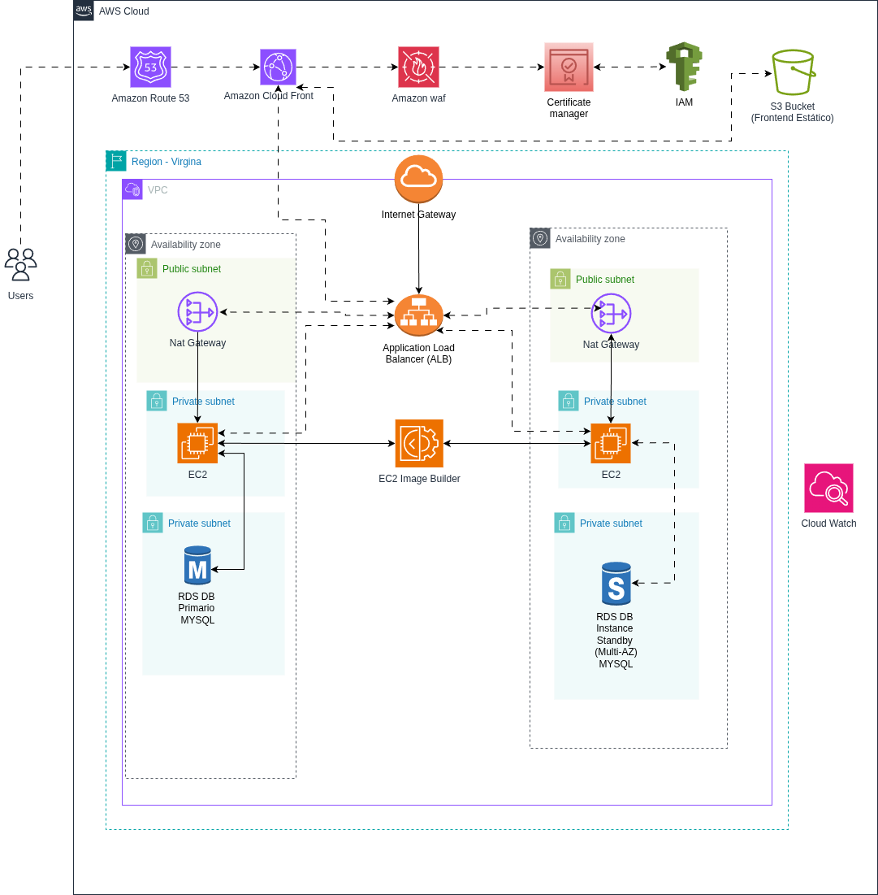

# SysManage TI

Sistema robusto de gestão de inventário de ativos de TI e colaboradores. Permite o controle centralizado de máquinas físicas, softwares e licenças, com dashboards visuais dinâmicos e controle de acesso baseado em funções.

## 🚀 Novidades desta Versão

* **Controle de Acesso (RBAC):** níveis de permissão implementados (Admin, Técnico e Leitura).
* **Gestão de Software:** campos específicos para conformidade, como fabricante, versão, chave de licença e data de expiração.
* **Dashboard Visual:** gráficos interativos integrados com Chart.js.
* **Relatórios:** exportação completa do inventário em formato CSV (compatível com Excel).
* **Segurança Reforçada:**

  * Autenticação via JWT utilizando Cookies HTTP-Only (`sameSite: strict`).
  * Filtro global Anti-XSS com `sanitize-html`.
  * Proteção contra força bruta com Rate Limiting e cabeçalhos seguros via Helmet.

## 🛠️ Tecnologias

| Camada       | Stack                                             |
| ------------ | ------------------------------------------------- |
| **Backend**  | Node.js, Express, MySQL, JWT e Cookies            |
| **Frontend** | HTML5, CSS3, JavaScript (Vanilla) e Bootstrap 5.3 |
| **Gráficos** | Chart.js                                          |

## 📋 Pré-requisitos

* Node.js 18 ou superior
* MySQL 8.x ou superior

## ⚙️ Início Rápido

### 1. Configuração do Banco de Dados

Crie o banco de dados e as tabelas executando os scripts contidos em `docs/AMBIENTE.md`.

```sql
CREATE DATABASE sysmanage_ti CHARACTER SET utf8mb4 COLLATE utf8mb4_unicode_ci;

CREATE USER 'sysmanage'@'localhost' IDENTIFIED BY 'sua_senha_segura';

GRANT ALL PRIVILEGES ON sysmanage_ti.* TO 'sysmanage'@'localhost';

FLUSH PRIVILEGES;
```

### 2. Configuração do Backend

```bash
cd sysmanage-ti/backend
npm install
npm run dev
```

Servidor disponível em:

```bash
http://localhost:3000
```

## 🌐 Acesso ao Sistema

O frontend é servido automaticamente pelo backend.

* Página Inicial / Login:
  `http://localhost:3000`

* Registro de Usuário:
  `http://localhost:3000/register.html`

## 📂 Estrutura do Projeto

```bash
Projeto/
├── sysmanage-ti/
│   ├── backend/
│   │   ├── server.js
│   │   └── .env
│   │
│   ├── frontend/
│   │   └── public/
│   │       ├── js/
│   │       ├── css/
│   │       └── assets/
│
├── docs/
│   ├── ARQUITETURA.md
│   ├── API.md
│   ├── AMBIENTE.md
│   └── DESENVOLVIMENTO.md
│
├── arquitetura_aws_sysmanage.png
├── Estimate -AWS.pdf
└── README.md
```

## 📖 Documentação Adicional

| Documento                       | Conteúdo                                       |
| ------------------------------- | ---------------------------------------------- |
| `docs/ARQUITETURA.md`           | Fluxo de autenticação e arquitetura do sistema |
| `docs/API.md`                   | Endpoints REST e níveis de permissão           |
| `docs/AMBIENTE.md`              | Estrutura SQL e variáveis de ambiente          |
| `docs/DESENVOLVIMENTO.md`       | Boas práticas e padrões do projeto             |
| `arquitetura_aws_sysmanage.png` | Arquitetura AWS proposta para o sistema        |
| `Estimate -AWS.pdf`             | Estimativa de custos da infraestrutura AWS     |

## ☁️ Arquitetura AWS

O projeto inclui uma arquitetura em nuvem baseada na AWS, projetada para oferecer alta disponibilidade, escalabilidade, segurança e desempenho para ambientes corporativos.

### Diagrama da Arquitetura

<p align="center">
  
</p>

A imagem acima representa a arquitetura proposta para implantação do SysManage TI em ambiente AWS.

### Componentes da Infraestrutura

| Serviço AWS                     | Finalidade                                         |
| ------------------------------- | -------------------------------------------------- |
| Amazon EC2                      | Hospedagem da aplicação backend e frontend         |
| Amazon RDS MySQL (Multi-AZ)     | Banco de dados relacional com alta disponibilidade |
| Application Load Balancer (ALB) | Distribuição de carga e balanceamento de tráfego   |
| Amazon CloudFront               | Entrega de conteúdo com baixa latência             |
| AWS WAF                         | Proteção contra ataques e ameaças web              |
| Amazon Route 53                 | Gerenciamento de DNS                               |
| AWS Certificate Manager (ACM)   | Gerenciamento de certificados SSL/TLS              |
| Amazon VPC                      | Isolamento e controle da rede                      |
| AWS IAM                         | Controle de acesso e governança                    |
| AWS IAM Access Analyzer         | Auditoria e validação de permissões                |

### Fluxo da Aplicação

1. O usuário acessa o sistema através do domínio configurado no Route 53.
2. O tráfego HTTPS é protegido por certificados emitidos pelo AWS Certificate Manager.
3. O AWS WAF filtra requisições maliciosas antes de chegarem à aplicação.
4. O CloudFront acelera a entrega de conteúdo estático.
5. O Application Load Balancer distribui as requisições entre as instâncias EC2.
6. As instâncias EC2 executam a aplicação SysManage TI.
7. Os dados são armazenados no Amazon RDS MySQL configurado em Multi-AZ para alta disponibilidade.

### Benefícios

* Escalabilidade sob demanda
* Alta disponibilidade do banco de dados com RDS Multi-AZ
* Balanceamento inteligente de carga
* Proteção avançada contra ameaças web
* Melhor desempenho global através do CloudFront
* Comunicação segura via HTTPS
* Governança e controle de acesso centralizados
* Arquitetura preparada para crescimento futuro

## 💰 Estimativa de Custos AWS

A documentação do projeto inclui uma estimativa de custos para execução da infraestrutura em ambiente AWS.

### Resumo Financeiro

| Item                 | Valor        |
| -------------------- | ------------ |
| Custo Inicial        | USD 202,36   |
| Custo Mensal         | USD 768,34   |
| Custo Anual Estimado | USD 9.422,44 |

> Valores calculados utilizando AWS Pricing Calculator e sujeitos a alterações conforme utilização, região AWS selecionada e volume de tráfego.

### Arquivos Relacionados

* `arquitetura_aws_sysmanage.png` — Diagrama da arquitetura AWS.
* `Estimate -AWS.pdf` — Estimativa detalhada de custos da infraestrutura.


## 🎥 Demonstração do Projeto

### Apresentação

https://www.youtube.com/watch?v=_BDGUJN5ghY

### Demonstração do Sistema

https://www.youtube.com/watch?v=qw5XLDT1ch8

### Documentação Completa

https://github.com/Kelvinsantosyz/sysmanage-ti/blob/main/docs/SYSMANAGE-TI.docx

### Repositório Oficial

https://github.com/Kelvinsantosyz/sysmanage-ti

## 🔐 Variáveis de Ambiente

Crie o arquivo:

```bash
sysmanage-ti/backend/.env
```

```env
DB_HOST=localhost
DB_PORT=3306
DB_USER=sysmanage
DB_PASS=sua_senha_segura
DB_NAME=sysmanage_ti

JWT_SECRET=uma_chave_longa_e_aleatoria

PORT=3000
```

# ✨ Recursos do Sistema

* Gestão de ativos de TI
* Controle de colaboradores
* Gestão de softwares e licenças
* Controle de permissões (RBAC)
* Dashboard interativo
* Exportação CSV
* Segurança reforçada
* Interface responsiva
* API REST integrada
* Arquitetura preparada para nuvem AWS
* Banco de dados com alta disponibilidade

---

**SysManage TI** — Eficiência e controle na gestão de ativos tecnológicos.
